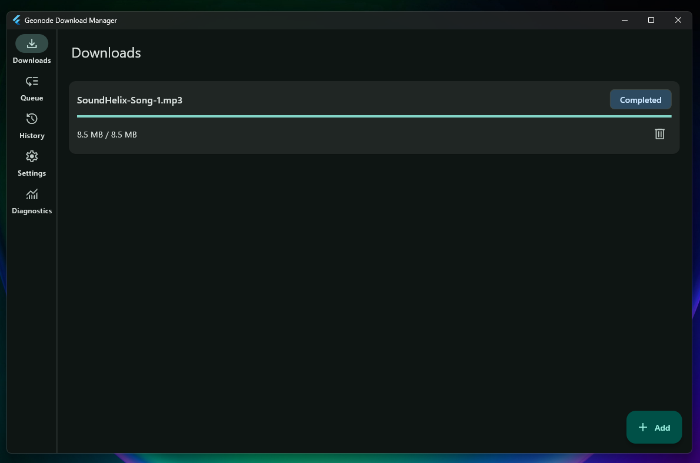

<p align="center">
  <strong>Fast, opinionated download manager for desktop and Android.</strong>
</p>

<p align="center">
  
</p>

## Status

Geonode Download Manager is a Flutter app with **Linux**, **Windows**, and **Android**
targets. Desktop builds use system `aria2c`. Android uses a native foreground
service with segmented HTTP Range downloads and publishes completed files to the
system Downloads collection via MediaStore.

The app focuses on direct HTTP/HTTPS file downloads, YouTube and Facebook
video extraction (including private Facebook via session login), queueing,
resume, and useful download details. Torrent downloads are not implemented yet;
see [Roadmap](#roadmap).

## Features

- [x] Material 3 UI (desktop navigation rail; phone bottom navigation)
- [x] Desktop: local aria2 process managed by the app
- [x] Android: foreground download service with progress notifications
- [x] One-active-download queue by default (configurable)
- [x] Pause, resume, retry, remove, and reorder
- [x] SQLite-backed history, queue, and settings
- [x] Download details with piece map
- [x] Desktop system tray integration
- [x] Chromium extension handoff through a native messaging host (desktop)
- [x] Android share / open-with intake for direct HTTP(S) URLs
- [x] YouTube video download with format selection (desktop: yt-dlp + ffmpeg; Android: built-in extractor)
- [x] YouTube playlists (queue each entry) and common URL styles (watch, Shorts, live, embed, music, youtu.be)
- [x] Facebook / fb.watch video download (desktop: yt-dlp; Android: progressive CDN extraction + HTTP)
- [x] Private / friends-only Facebook videos via in-app session login (Android WebView) or desktop cookies.txt / browser cookie import

## Roadmap

Planned work (not shipped):

- [ ] YouTube authenticated / private streams and channel pages
- [ ] More video sites (Dailymotion, …)
- [ ] Torrent / magnet support
- [ ] Signed Play Store releases (production keystore in CI)
- [x] Automated Windows release zip in CI
- [ ] Automated Linux release artifacts in CI

## Requirements

### End users (release installs)

Install **only Geonode Download Manager**. Official Windows zip releases bundle
**aria2**, **yt-dlp**, and **ffmpeg**. Android APKs use a native download service
for HTTP, a built-in YouTube extractor, and bundled **ffmpeg** (`libffmpeg.so`)
for high-resolution merges — no separate tool installs required.

Release packages include [`packaging/THIRD_PARTY_NOTICES.md`](packaging/THIRD_PARTY_NOTICES.md).

### Developers

- Flutter 3.41+
- Dart 3.11+

Before building a release locally, fetch bundled tools:

```powershell
# Windows
powershell -File tool/windows/fetch_deps.ps1

# Linux
make fetch-deps

# Android
powershell -File tool/android/fetch_deps.ps1
```

During development, `flutter run` can still use tools from PATH if bundled
`bin/` is not present yet.

### Linux build host

- Linux desktop build dependencies for Flutter
- AppIndicator/Ayatana development headers for tray support
- `lld-21` or another linker available next to `clang++`
- `python3` when using the bundled Linux yt-dlp script
- Bundled tools from `make fetch-deps` **or** system `aria2c`, `yt-dlp`, and `ffmpeg` on PATH

On Debian/Ubuntu-like systems:

```sh
sudo apt install python3 clang cmake ninja-build pkg-config libgtk-3-dev libstdc++-12-dev libayatana-appindicator3-dev lld-21
```

### Windows build host

- [Visual Studio](https://visualstudio.microsoft.com/) with the **Desktop development with C++** workload
- Windows Developer Mode enabled (Flutter plugin symlinks), or equivalent symlink privilege

### Android build host

- Android SDK with cmdline-tools, platform-tools, and a recent platform (API 35+)
- Accepted Android SDK licenses (`flutter doctor --android-licenses`)
- Run `tool/android/fetch_deps.ps1` before `flutter build apk` / `appbundle` so
  `libffmpeg.so` and `libc++_shared.so` are installed under
  `android/app/src/main/jniLibs/<abi>/` (requires a local Android NDK)

Android direct HTTP downloads run in `DownloadForegroundService`. YouTube on
Android uses `youtube_explode_dart` for metadata/streams and bundled ffmpeg
(`libffmpeg.so`) to merge high-resolution video+audio (same style of format
list as desktop). Public Facebook videos are resolved to progressive CDN MP4
URLs and downloaded over HTTP (no yt-dlp process). Private Facebook videos use
an in-app WebView login that stores session cookies on-device (Settings →
Facebook); those cookies are sent with page and CDN requests. On desktop,
yt-dlp can also use a Netscape cookies.txt file or `--cookies-from-browser`.
APK size grows substantially
because static ffmpeg is packaged per ABI. YouTube downloading may conflict
with Play Store policy; sideload/dev builds are the safest target for now.

## Development

```sh
flutter pub get
dart run build_runner build
flutter analyze
flutter test
```

### Linux

```sh
make run
# or
flutter run -d linux
```

The Makefile also provides:

```sh
make run          # debug launch through Flutter
make run-log      # debug launch and write stdout/stderr to the user state dir
make run-verbose  # debug launch with verbose Flutter logs
make build-debug
make run-debug-bundle
```

### Windows

```powershell
powershell -File tool/windows/fetch_deps.ps1
flutter run -d windows
# release build (fetch + copy bundled tools automatically):
powershell -File tool/windows/build.ps1
```

### Android

```powershell
powershell -File tool/android/fetch_deps.ps1
flutter devices
flutter run -d <android-device-id>
```

Optional smoke harness:

```powershell
flutter test integration_test/android_smoke_test.dart -d <android-device-id>
```

## Chromium Extension

Desktop only. Android uses share / view intents instead.

### Linux

`make install` installs the Geonode Download Manager app, the `geonode-download-manager-host` native messaging bridge,
and native host manifests for Google Chrome, Chromium, and Brave.

### Windows

`tool/windows/install.ps1` installs under `%LOCALAPPDATA%\geonode-download-manager`, copies
`geonode-download-manager-host.exe`, writes the native messaging manifest, and registers HKCU
keys for Chrome, Chromium, Edge, and Brave.

To use the extension during development:

1. Install Geonode Download Manager (`make install` on Linux, or `powershell -File tool/windows/install.ps1` on Windows).
2. Open `chrome://extensions`, `edge://extensions`, or `brave://extensions`.
3. Enable Developer mode.
4. Choose **Load unpacked** and select `extensions/chrome`.

The extension adds a **Download with Geonode** link context-menu item. Automatic
download capture is off by default and can be enabled from the extension popup.
Manual captures can launch Geonode Download Manager when needed. Automatic captures only hand off to
an already-running Geonode Download Manager instance; if Geonode Download Manager is unavailable, the extension falls
back to the browser download and shows a notification.

On Windows, the running app publishes a loopback TCP endpoint file at
`%LOCALAPPDATA%\geonode-download-manager\extension-endpoint.json` for `geonode-download-manager-host`. Linux continues
to use a Unix domain socket under `$XDG_RUNTIME_DIR`.

## Build

### Linux

```sh
make build
```

The release bundle is written to `build/linux/x64/release/bundle/`.

### Windows

```powershell
powershell -File tool/windows/build.ps1
```

The release bundle is written to `build/windows/x64/runner/Release/`.
`build/geonode-download-manager-host.exe` is produced for native messaging.

### Android

```powershell
powershell -File tool/android/fetch_deps.ps1
flutter build apk --release
flutter build appbundle --release
```

`fetch_deps.ps1` installs static ffmpeg as
`android/app/src/main/jniLibs/<abi>/libffmpeg.so` plus matching
`libc++_shared.so` from the Android NDK (required to run ffmpeg). CI runs the
same step before packaging.

Outputs:

- APK: `build/app/outputs/flutter-apk/app-release.apk`
- App Bundle: `build/app/outputs/bundle/release/app-release.aab`

Release builds currently sign with the debug keystore so local install works.
Replace `signingConfig` in `android/app/build.gradle.kts` with your Play Store
keystore before publishing.

## Install Locally

### Linux

```sh
make install
```

This builds and installs the release bundle under `~/.local/share/geonode-download-manager`, creates
`~/.local/bin/geonode-download-manager`, installs the desktop entry and icon, and installs the
native messaging host.

If you already ran `make build`, install the existing build without rebuilding:

```sh
make install-built
```

To uninstall:

```sh
make uninstall
```

### Windows

```powershell
powershell -File tool/windows/install.ps1
```

This installs to `%LOCALAPPDATA%\geonode-download-manager`, creates a Start Menu shortcut, and
registers native messaging hosts for Chrome, Chromium, Edge, and Brave.

To uninstall:

```powershell
powershell -File tool/windows/uninstall.ps1
```

### Android

Install a debug/release APK on a connected device:

```powershell
flutter install -d <android-device-id>
# or
adb install build/app/outputs/flutter-apk/app-release.apk
```

## License

[MIT](LICENSE)
